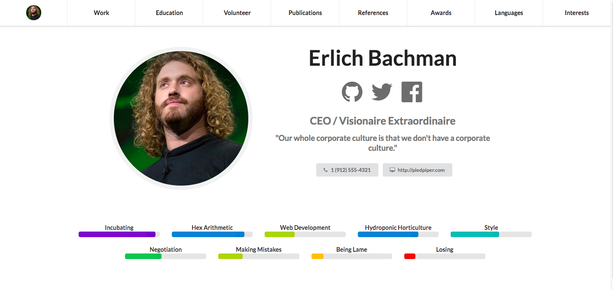

### React Awesome Resume

#### [DEMO](https://deltaskelta.github.io/react-awesome-resume-demo)



```bash
npm install react-awesome-resume semantic-ui-css
```

### Include the stylesheet for semantic-ui in your project

```bash
import Resume from 'react-awesome-resume';
import 'semantic-ui-css/semantic.min.css';
```

### Pass your props to the Resume

#### `jsonResume` [object]

`jsonResume` is an object in the [JSON Resume](https://jsonresume.org/) format, see the
example in [person.js](./src/person.js) 

#### `theme` [string]

`theme` is a string indicating which resume theme to use, currently the supported themes
are:

- default

#### `inline` [bool]

`inline` is a boolean value which indicates whether or not the resume is meant to be
rendered `inline` with other content on the page or if it is meant to be fullscreen. If the
Resume is rendered `inline`, it needs to be in a div that is at least `720px` wide or else
it will not display correctly.

### Render the component with your person and your theme

```jsx

import React from "react";
import ReactDOM from "react-dom";
import Resume from 'react-awesome-resume'
import 'semantic-ui-css/semantic.min.css';

const myJSONResume = {//...jsonResume}

ReactDOM.render(
  <Resume person={myJSONResume} theme="default" />,
  document.getElementById("root")
);
```

### TODO:

 - subtitles need to be changed for small screen renders
 - update to react 16 when a release occurs for semantic-ui
 - add API requests to main page from twitter / medium / github
